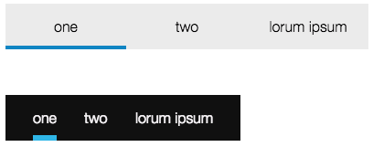
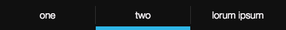
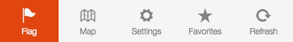
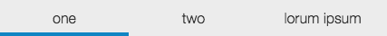
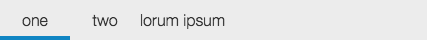
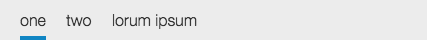
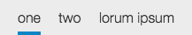
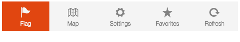

TabBar Tutorial
==========

TabBar widget for famo.us.



[View the live demo here](https://rawgit.com/IjzerenHein/famous-flex-tabbar/master/dist/index.html)


# Index

- [Getting started](#getting-started)
- [API reference](https://github.com/IjzerenHein/famous-flex/blob/master/docs/widgets/TabBar.md)
- [Code examples](../src/main.js) ([CSS](../src/styles.css))
- [Renderables & CSS classes](#renderables--css-classes)
    - [Custom renderables](#custom-renderables)
    - [CSS classes](#css-classes)
    - [Overview of renderables and their CSS-selectors](#overview-of-renderables-and-their-css-selectors)
    - [Example of a black Android like style](#example-of-a-black-android-like-style)
- [Adding tab items](#adding-tab-items)
- [Getting and setting the selected tab](#getting-and-setting-the-selected-tab)
- [Handling tab-changes](#handling-tab-changes)
- [Spacing & margins](#spacing--margins)
- [Sizing Modes](#sizing-modes)
- [Vertical orientation](#vertical-orientation)
- [A bouncy example](#a-bouncy-example)

# Getting started

To use the TabBar in your project, install famous-flex using npm or bower:

    npm install famous-flex

    bower install famous-flex

To create the TabBar use:

```javascript
var TabBar = require('famous-flex/widgets/TabBar');

var tabBar = new TabBar({
    createRenderables: {
        background: true,
        selectedItemOverlay: true
    }
});
tabBar.setItems([
    'one',
    'two',
    'three'
]);
this.add(tabBar); // add to the render-tree
```

Include the widgets css file in your project:

Using webpack:

```javascript
require('famous-flex/widgets/styles.css');
```

Or in your html file:

```html
<head>
  <link rel="stylesheet" type="text/css" href="famous-flex/src/widgets/styles.css">
</head>
```


# Renderables & CSS-classes

By default, the TabBar only creates renderables (Surfaces) for the actual tab-items.
You can choose to enable other renderables, such as the background, spacers in 
between items and a selected item overlay. To enable these renderables, set their values
in the `createRenderables` option to `true`.

```javascript
var tabBar = new TabBar({
    createRenderables: {
        background: true,
        selectedItemOverlay: true,
        spacer: true
    }
})
```

## Custom renderables

To create or use your own renderables, specify a factory `Function`
instead of `true/false`:

```javascript
var tabBar = new TabBar({
    createRenderables: {
        item: function(id, data) {
            return new Surface({
                content: data,
                properties: {
                    background: 'rgba(255, 255, 255, 0.5)',
                    color: '#222222'
                }
            })
        }
    }
});
```

## CSS classes

When a Surface is created, it is assigned multiple css-classes which can be
styled from a css-file. The `widgets/styles.css` already contains various styles so that text is centered correctly. Example of a white tab-bar style:

```css
.ff-tabbar.background {
  background-color: #ECECEC;
}
.ff-tabbar.item {
  color: #333333;
}
.ff-tabbar.selectedItemOverlay {
  border-bottom: 4px solid #1185c3;
}
```


## Overview of renderables and their CSS-selectors

|Renderable|CSS-selector|Description|
|---|---|---|
|`background`|`.ff-tabbar.background`|Background renderable.|
|`item`|`.ff-tabbar.item`|Tab-item.|
|`spacer`|`.ff-tabbar.spacer`|Spacer renderable in between items.|
|`selectedItemOverlay`|`.ff-tabbar.selectedItemOverlay`|Renderable that has the same size as the selected item and lays on top of it.|


## Example of a black Android like style



In order to create "themes", you can assign additional css-classes to the renderables by specifying
the `classes` option in the constructor:

```javascript
var tabBar = new TabBar({
    classes: ['black'],
    createRenderables: {
        background: true,
        selectedItemOverlay: true
        spacer: true
    }
})
```

CSS:

```css
.ff-tabbar.background.black {
  background-color: #101010;
}
.ff-tabbar.item.black {
  color: #f7f3f7;
}
.ff-tabbar.selectedItemOverlay.black {
  border-bottom: 6px solid #30b6e7;
}
.ff-tabbar.spacer.black:after {
  content: "";
  background-color: #333333;
  width: 100%;
  top: 10px;
  bottom: 10px;
  position: absolute;
}
```


# Adding tab-items

To add tab-items use the `setItems` function:

```javascript
var tabBar = new TabBar();
tabBar.setItems([
    'one',
    'two',
    'three'
]);
```

The content of each item is placed inside a Surface. You can also specify HTML contents
and use images and text like this:

```javascript
tabBar.setItems([
    '<div class="icon ion-flag"></div>Flag',
    '<div class="icon ion-map"></div>Map',
    '<div class="icon ion-gear-a"></div>Settings'
]);
```




# Getting and setting the selected tab

To get and set the selected tab, use `getSelectedItemIndex` and `setSelectedItemIndex`:

```javascript
var tabBar = new TabBar();
tabBar.setItems([
    'one',
    'two',
    'three'
]);

// Get and set the selected tab
tabBar.setSelectedItemIndex(2); // select
var index = tabBar.getSelectedItemIndex();
```


# Handling tab-changes

When the user clicks on a tab, it becomes selected and a `tabchange` event is emitted:

```javascript
tabBar.on('tabchange', function(event) {
    console.log('selected tab: ' + event.index);
});
```
The following properties are passed along as event-data:

```
{
    target: TabBar,         // TabBar instance that emitted the event
    index: Number,          // index of the newly selected tab
    oldIndex: Number        // index of the previously selected tab
    item: Renderable,       // tab-item renderable that was selected
    oldItem: Renderable     // previous tab-item renderable that was selected
}
```


# Spacing & margins

Spacing & margins are handled by the underlying TabBarLayout. To change them use:

```javascript
var tabBar = new TabBar({
    tabBarLayout: {
        spacing: 30
        margins: [10, 20, 10, 20] // clockwise, top, right, bottom, right
    }
});
```


# Sizing Modes

By default, all tab-items are given an equal width and are spread out over the full
width of the TabBar:



The size of a tab-item can also be set to a fixed width, by setting the `itemSize` options
of the `tabBarLayout` options to a fixed value:

```javascript
var tabBar = new TabBar({
    tabBarLayout: {
        itemSize: 70
    }
});
```



Or you can use the actual size from the renderable, by setting `itemSize` to `true`:

```javascript
var tabBar = new TabBar({
    tabBarLayout: {
        itemSize: true,
        margins: [0, 20],
        spacing: 20
    }
});
```



It is also possible, to let the TabBar calculate its own size based on the added tab-items.
To do this, set the size of the underlying LayoutController to `[true, undefined]`:

```javascript
var tabBar = new TabBar({
    layoutController: {
        size: [true, undefined]
    },
    tabBarLayout: {
        itemSize: true,
        margins: [0, 20],
        spacing: 20
    }
});
```




# Vertical orientation

To vertically orient the TabBar use:

```javascript
var tabBar = new TabBar({
    layoutController: {
        direction: 1
    }
});
```


# A bouncy example

Instead of adding Surfaces you can add any renderable to the TabBar.
If the renderable supports event handling, then the tab-bar will automatically
attach a `click` handler to it in order to make tab-switching possible.
The following example shows how to create a bounce effect using a custom renderable:



```javascript
var bouncyCustomRenderables = [];
function _createBouncyCustomRenderable(id, data) {
    var mod = new StateModifier();
    var node = new RenderNode(mod);
    var surface = new Surface({
        classes: ['ff-widget', 'ff-tabbar', 'images', 'item', 'small', 'orange'],
        content: '<div><div class="icon ion-' + data.icon + '"></div>' + data.text + '</div>'
    });
    if (bouncyCustomRenderables.length === 0) {
        surface.addClass('selected');
    }
    // since the render-node that is added to the TabBar cannot handle events,
    // install a handler which switches selection on the surface.
    surface.on('click', this.setSelectedItemIndex.bind(this, bouncyCustomRenderables.length));
    node.add(surface);
    bouncyCustomRenderables.push({
        mod: mod,
        surface: surface,
        node: node
    });
    return node;
}
tabBar = new TabBar({
    createRenderables: {
        background: true,
        item: _createBouncyCustomRenderable
    }
});
tabBar.setItems([
    {icon: 'flag', text: 'Flag'},
    {icon: 'map', text: 'Map'},
    {icon: 'gear-a"', text: 'Settings'},
    {icon: 'star', text: 'Favorites'},
    {icon: 'refresh', text: 'Refresh'}
]);
tabBar.on('tabchange', function(event) {

    // On tab-change, toggle the selection class on the old and new surface
    bouncyCustomRenderables[event.oldIndex].surface.removeClass('selected');
    bouncyCustomRenderables[event.index].surface.addClass('selected');

    // Bounce up when an item is selected
    bouncyCustomRenderables[event.index].mod.halt();
    bouncyCustomRenderables[event.index].mod.setTransform(Transform.translate(0, 60, 0), {duration: 0});
    bouncyCustomRenderables[event.index].mod.setTransform(Transform.rotate(0, 0, 0), {duration: 140, curve: Easing.outBack});
});
```

CSS:

```css
.ff-tabbar.item {
  font-size: 12px;
  color: #818181;
}
.ff-tabbar.item .icon {
  font-size: 24px;
}
.ff-tabbar.item.selected {
  color: #f5f5f5;
  background-color: #E14610;
}
.ff-tabbar.background {
  background-color: #f5f5f5;
}
```

*© 2015 IjzerenHein*
