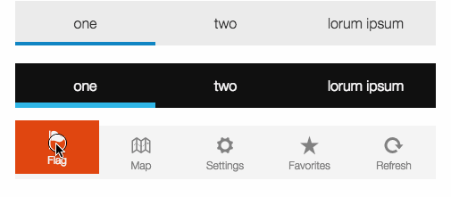

TabBar
==========

TabBar widget for famo.us.



[View the live demo here](https://rawgit.com/IjzerenHein/famous-flex-tabbar/master/dist/index.html)


# Index

- [Getting started](#getting-started)
- [API reference](https://rawgit.com/IjzerenHein/famous-flex/docs/widgets/TabBar.md)
- [Getting and setting the selected tab](#getting-and-setting-the-selected-tab)
- [Handling tab-changes](#handling-tab-changes)
- [Spacing & margins](#spacing--margins)
- [Sizing Modes](#sizing-modes)
- [Vertical orientation](#vertical-orientation)
- [Custom renderables](#custom-renderables)


# Getting started

To use the TabBar in your project, install famous-flex using npm or bower:

    npm install famous-flex

    bower install famous-flex

To create the TabBar use:

```javascript
var TabBar = require('famous-flex/widgets/TabBar');

var tabBar = new TabBar();
tabBar.setItems([
    'one',
    'two',
    'three'
]);
this.add(tabBar); // add to the render-tree
```

Include the widgets css in your project:

```html
<head>
  <link rel="stylesheet" type="text/css" href="famous-flex/widgets/styles.css">
</head>
```


# Adding tab-items

To add tab-items use the `setItems` function:

```javascript
var tabBar = new TabBar();
tabBar.setItems([
    'one',
    'two',
    'three'
]);
```

The content of each item is placed inside a Surface. You can also specify HTML contents
and use images and text like this:

```javascript
tabBar.setItems([
    '<div class="icon ion-flag"></div>Flag',
    '<div class="icon ion-map"></div>Map',
    '<div class="icon ion-gear-a"></div>Settings'
]);
```


# Getting and setting the selected tab

To get and set the selected tab, use `getSelectedItemIndex` and `setSelectedItemIndex`:

```javascript
var tabBar = new TabBar();
tabBar.setItems([
    'one',
    'two',
    'three'
]);

// Get and set the selected tab
tabBar.setSelectedItemIndex(2); // select
var index = tabBar.getSelectedItemIndex();
```


# Handling tab-changes

When the user clicks on a tab, it becomes selected and a `tabchange` event is emitted:

```javascript
tabBar.on('tabchange', function(event) {
    console.log('selected tab: ' + event.index);
});
```
The following properties are passed along as event-data:

```
{
    target: TabBar,         // TabBar instance that emitted the event
    index: Number,          // index of the newly selected tab
    oldIndex: Number        // index of the previously selected tab
    item: Renderable,       // tab-item renderable that was selected
    oldItem: Renderable     // previous tab-item renderable that was selected
}
```


## CSS classes

At the topmost level, the DatePicker consists of a ContainerSurface using
the class `famous-flex-datepicker`. This class can be modified, by specifying
the `container` option in the constructor:

```javascript
var datePicker = new DatePicker({
    container: {
        classes: ['famous-flex-datepicker'] // specify your custom class(es) here
    }
});
```

Each item in the DatePicker is assigned the class `item` and a class which
corresponds to the component (e.g. `year`, `hour`, `weekday`, ...).
To for instance set the line-height and font-size for all components, use:

```css
.famous-flex-datepicker .item {
    text-align: center;
    font-size: 40px;
    line-height: 100px;
}
```

To customize a specific component, use its css-class:

```css
.famous-flex-datepicker .year {
    text-align: left;
}
```


# Spacing & margins

Spacing & margins are handled by the underlying TabBarLayout. To change them use:

```javascript
var tabBar = new TabBar({
    tabBarLayout: {
        spacing: 30
        margins: [10, 20, 10, 20] // clockwise, top, right, bottom, right
    }
});
```


# Sizing Modes

By default, all tab-items are given an equal width and are spread out over the full
width of the TabBar:


The size of a tab-item can also be set to a fixed width, by setting the `itemSize` options
of the `tabBarLayout` options to a fixed value:

```javascript
var tabBar = new TabBar({
    tabBarLayout: {
        itemSize: 70
    }
});
```


Or you can use the actual size from the renderable, by setting `itemSize` to `true`:

```javascript
var tabBar = new TabBar({
    tabBarLayout: {
        itemSize: true,
        margins: [0, 20],
        spacing: 20
    }
});
```


It is also possible, to let the TabBar calculate its own size based on the added tab-items.
To do this, set the size of the underlying LayoutController to `[true, undefined`:

```javascript
var tabBar = new TabBar({
    layoutController: {
        size: [true, undefined]
    },
    tabBarLayout: {
        itemSize: true,
        margins: [0, 20],
        spacing: 20
    }
});
```


# Vertical orientation

To vertically orient the TabBar use:

```javascript
var tabBar = new TabBar({
    layoutController: {
        direction: 1
    }
});
```


# Custom renderables

By default the TabBar creates its own surfaces that make up the Tab-bar.
You can override this behavior and use your own renderables, or disable certain
surfaces such as the background. To do this, override the `createRenderable`
function in the constructor options:

```javascript
var tabBar = new TabBar({
    createRenderable: function (id, data) {
        if (id === 'item') {
            // create our own surface per item
            return new Surface({
                classes: ['mytabbar-item'],
                content: '<div><div class="icon ion-' + data.icon + '"></div>' + data.text + '</div>'
            });
        }
        else {
            // create default surfaces for background and selectedItemOver
            return TabBar.prototype.createRenderable.call(this, id, data);
        }
    }
});
tabBar.setItems([
    {icon: 'flag', text: 'Flag'},
    {icon: 'map', text: 'Map'},
    {icon: 'gear-a', text: 'Settings'}
]);
```

Instead of adding Surfaces you can add any renderable to the TabBar.
If the renderable supports event handling, then the tab-bar will automatically
attach a `click` handler to it in order to make tab-switching possible.
The following example shows how to create a bounce effect using a custom renderable:


```javascript
var bouncyCustomRenderables = [];
function _createBouncyCustomRenderable(id, data) {
    if (id === 'item') {
        var mod = new StateModifier();
        var node = new RenderNode(mod);
        var surface = new Surface({
            classes: ['ff-widget', 'ff-tabbar', 'images', 'item', 'small', 'orange'],
            content: '<div><div class="icon ion-' + data.icon + '"></div>' + data.text + '</div>'
        });
        if (bouncyCustomRenderables.length === 0) {
            surface.addClass('selected');
        }
        // since the render-node that is added to the TabBar cannot handle events,
        // install a handler which switches selection on the surface.
        surface.on('click', this.setSelectedItemIndex.bind(this, bouncyCustomRenderables.length));
        node.add(surface);
        bouncyCustomRenderables.push({
            mod: mod,
            surface: surface,
            node: node
        });
        return node;
    }
    else {
        return TabBar.prototype.createRenderable.call(this, id, data);
    }
}
tabBar = new TabBar({
    classes: ['images', 'small', 'orange'],
    createRenderable: _createBouncyCustomRenderable
});
tabBar.setItems([
    {icon: 'flag', text: 'Flag'},
    {icon: 'map', text: 'Map'},
    {icon: 'gear-a"', text: 'Settings'},
    {icon: 'star', text: 'Favorites'},
    {icon: 'refresh', text: 'Refresh'}
]);
tabBar.on('tabchange', function(event) {

    // On tab-change, toggle the selection class on the old and new surface
    bouncyCustomRenderables[event.oldIndex].surface.removeClass('selected');
    bouncyCustomRenderables[event.index].surface.addClass('selected');

    // Bounce up when an item is selected
    bouncyCustomRenderables[event.index].mod.halt();
    bouncyCustomRenderables[event.index].mod.setTransform(Transform.translate(0, 60, 0), {duration: 0});
    bouncyCustomRenderables[event.index].mod.setTransform(Transform.rotate(0, 0, 0), {duration: 140, curve: Easing.outBack});
});
```


*© 2015 IjzerenHein*
